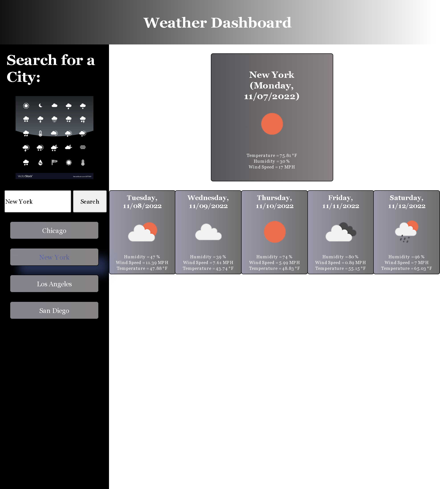

# Week-6-Challenge-Planner
## Server-Side-APIs-Weather-Dashboard

### Challenge Goals
 * Create weather dashboard that will run in the browesr and feature dynamically updated HTML and CSS.
 * App will display today's weather, as well as provide a 5 Day Weather Forecast using Open Weather API.

## Build With:
* HTML/CSS
* Javascript
* Moment.js
* Open Weather Map API

## Screenshot

## Acceptance Criteria
GIVEN a weather dashboard with form inputs
WHEN I search for a city
THEN I am presented with current and future conditions for that city and that city is added to the search history
WHEN I view current weather conditions for that city
THEN I am presented with the city name, the date, an icon representation of weather conditions, the temperature, the humidity, and the wind speed
WHEN I view future weather conditions for that city
THEN I am presented with a 5-day forecast that displays the date, an icon representation of weather conditions, the temperature, the wind speed, and the humidity
WHEN I click on a city in the search history
THEN I am again presented with current and future conditions for that city

## Status
* All acceptance criterias have been met: 
    * Functional dashboard display all required data inputed into storage to provide the weather data for current day, as well as the next five days.
    * Search history is provided below search area, which can be clicked to provide data of previous city searches.
* Deployed links:
    * Live link: https://louyoon89.github.io/Weather-Dashboard-Five-Day-Forecast/
    * Github link: https://github.com/louyoon89/Weather-Dashboard-Five-Day-Forecast
